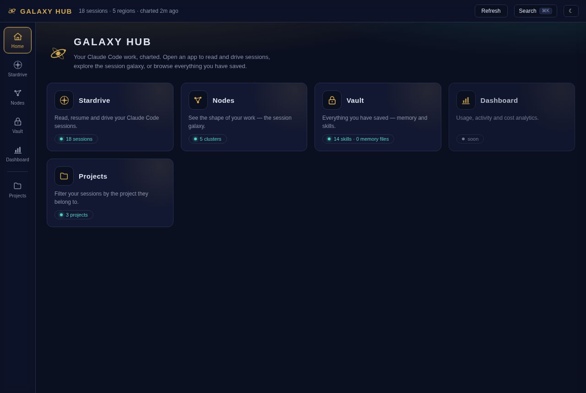
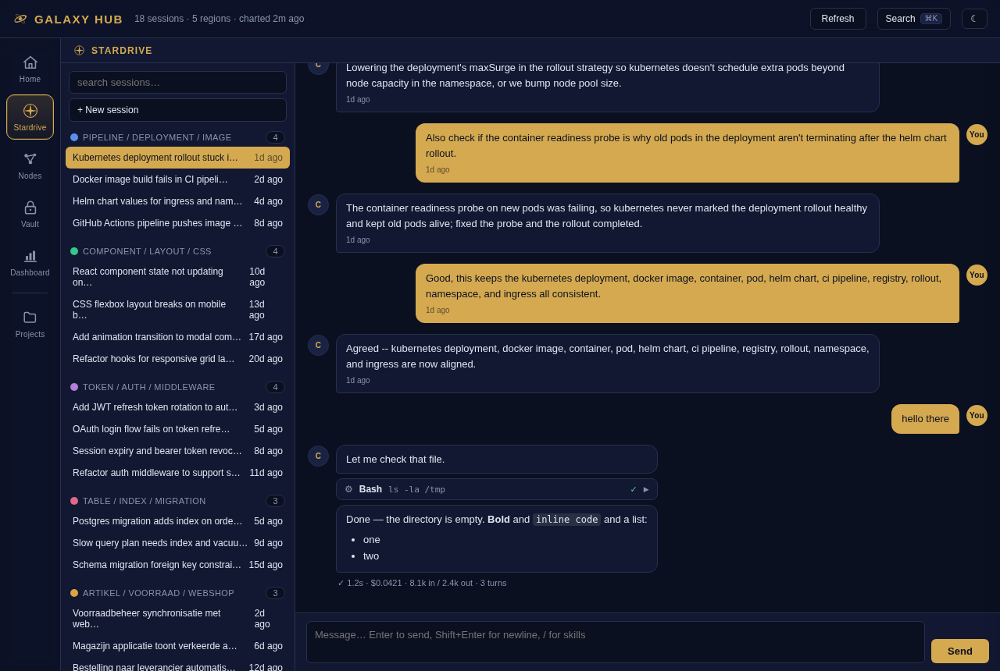
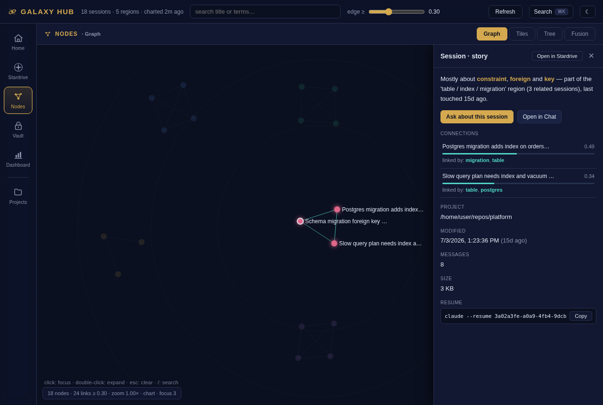
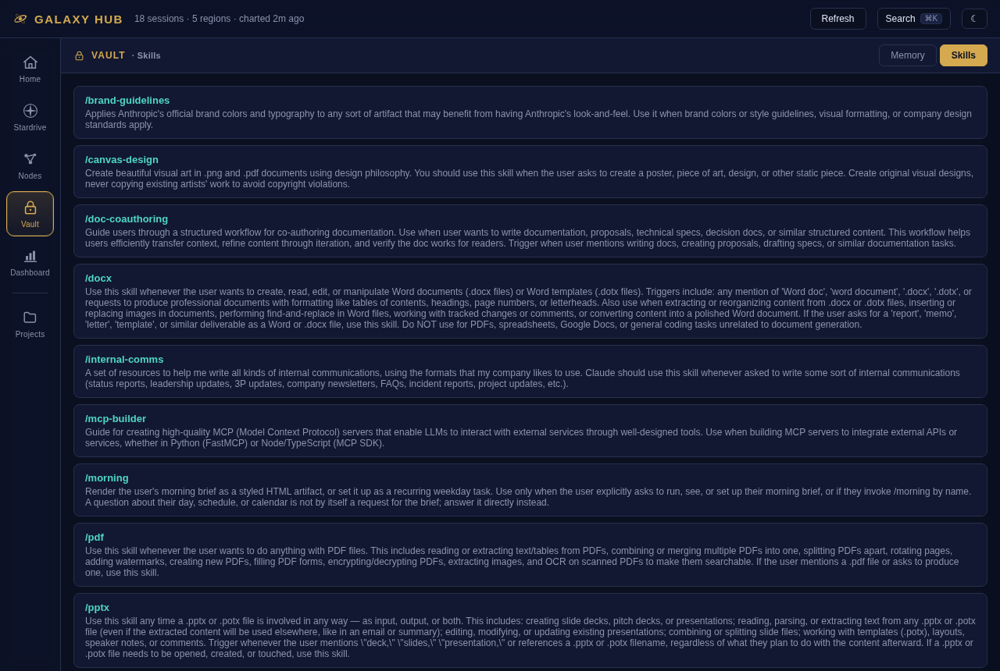
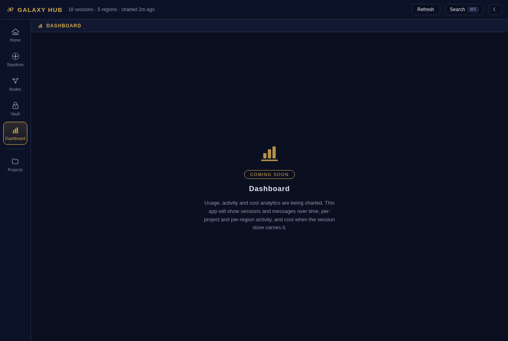
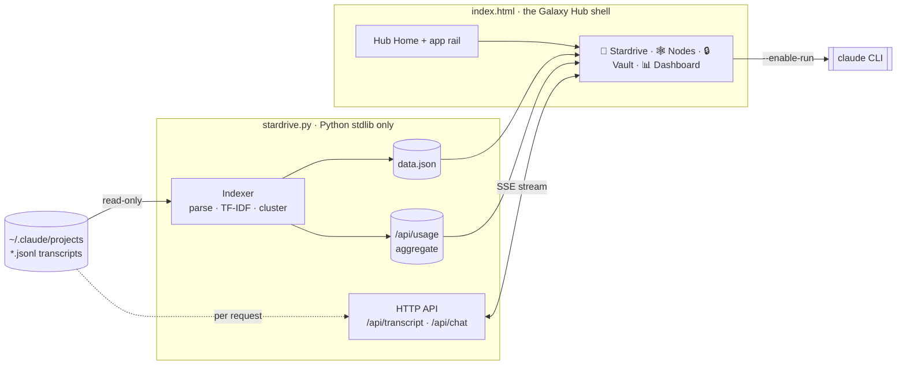

<div align="center">

# 🌌 GALAXY HUB

**A local platform for your Claude Code work — pilot agents, map your session galaxy, all on your machine.**

[](LICENSE)
[](https://www.python.org/)
[](#-why-galaxy-hub)
[](#-security--privacy)
[](#-accessibility)

</div>



Claude Code stores every conversation as a `.jsonl` transcript, but the built-in UI only ever shows you a flat, chronological list. **Galaxy Hub** reads that store (read-only) and turns it into a workspace you can actually navigate: a local **hub of focused apps** behind one shell — read and resume any session as a real chat thread, see the *shape* of everything you've ever worked on, and keep the whole thing to **two auditable files** with no build step, no cloud, and no telemetry.

---

## Contents

- [Why Galaxy Hub](#-why-galaxy-hub)
- [The apps](#-the-apps)
- [Architecture](#-architecture)
- [Quickstart](#-quickstart)
- [Deploy](#-deploy)
- [Security & privacy](#-security--privacy)
- [Accessibility](#-accessibility)
- [Roadmap](#-roadmap)
- [Contributing](#-contributing)
- [License](#-license)

---

## 🌠 Why Galaxy Hub

**Every other Claude Code tool renders a _list_. Galaxy Hub renders a _map_.**

There are dozens of session viewers in the ecosystem. Every one of them answers the same question — *"show me my sessions"* — as a chronological, searchable feed. Galaxy Hub answers a different one: **"show me the shape of my work."** Sessions are auto-clustered by what they're *about*, laid out as a force-directed star-chart, and explained in plain language — click any node and it tells you which cluster it belongs to and *why* it links to each neighbour. Nobody else in the category does this.

The second differentiator is the **stack**. Your transcripts contain your prompts, your code, and possibly your secrets. The rest of the ecosystem points React / Tauri / Electron / Node bundles — often hundreds of npm packages — straight at that data. Galaxy Hub is two files you can read end-to-end before you trust them:

| | Galaxy Hub | Typical alternative |
|---|---|---|
| **Footprint** | 2 files — `stardrive.py` + `index.html` | Node / Electron / Tauri, hundreds of deps |
| **Network** | zero external requests, ever | CDNs, fonts, analytics, telemetry |
| **Binding** | loopback by default, Host-checked | varies |
| **Store access** | read-only over `~/.claude` | varies |
| **Visualization** | hand-rolled inline SVG / canvas | chart & graph libraries |

Trust isn't a footnote here — it's a feature.

---

## 🛸 The apps

Galaxy Hub opens on **Hub Home** — a launcher grid of app cards, each with a glyph, a one-liner, and one live stat. A persistent **app rail** down the left switches between apps; the command palette (`Ctrl`/`Cmd`+`K`) jumps straight to any app, session, or view. Each app owns its own internal views, and everything stays in one URL hash so links and reloads land exactly where you left off.

### 🚀 Stardrive — the prompt interface

<table>
<tr>
<td width="55%">



</td>
<td width="45%">

Read any session as a real, threaded conversation — tool calls, thinking, and per-turn cost and token stats included — then **prompt right there**. Start a new session or resume an existing one, streamed live through the Claude Code CLI over SSE, with a **Stop** button and `/` skill autocomplete. This is the app the original *Stardrive* project was; inside Galaxy Hub it's the cockpit you drive agents from.

</td>
</tr>
</table>

### 🕸 Nodes — the session galaxy

<table>
<tr>
<td width="45%">

Everything Galaxy Hub knows about the *shape* of your work, in four views. **Graph** is a force-directed star-chart where edges are topic similarity and nodes glow by cluster — focus a neighbourhood, expand it ring by ring, and read the story panel. **Tiles** shows the same clusters as cards; **Tree** as a project → topic → session hierarchy; **Fusion** surfaces groups of sessions that are probably the same thread of work, ready to merge or compact by hand.

</td>
<td width="55%">



</td>
</tr>
</table>

### 🔒 Vault — everything you've saved

<table>
<tr>
<td width="55%">



</td>
<td width="45%">

One place for everything Claude Code carries between sessions: your **memory** and your **skills**, browsable and one click from being used. The prompt / snippet library and cross-app search are on the way (see the [Roadmap](#-roadmap)).

</td>
</tr>
</table>

### 📊 Dashboard — usage, activity & cost

<table>
<tr>
<td width="45%">

Sessions and messages over time, per-project and per-cluster activity, and **cost / token totals** when your store carries them. The data layer already ships — a `GET /api/usage` endpoint aggregates it all at index time — and the charts are hand-rolled inline SVG, so the zero-dependency law holds. **The Dashboard app UI is in progress**; the backend it reads from is live today.

</td>
<td width="55%">



</td>
</tr>
</table>

### 🛰 Orchestration — parallel & multi-agent runs · _coming_

Driving several agents at once, side by side. Designed, not yet built — tracked on the [Roadmap](#-roadmap).

<div align="center">

🌗 Light + dark themes · ♿ keyboard-operable, screen-reader aware, reduced-motion · 📱 responsive down to phone width — **across every app**.

</div>

---

## 🧭 Architecture

Two files. A Python-stdlib backend indexes your store into `data.json` plus a usage aggregate; one self-contained HTML page is the hub shell that renders every app from that data and streams live chat back through the Claude CLI.



<details>
<summary><strong>How it works</strong> — the indexing pipeline in four steps</summary>

<br/>

1. Streams the top-level `*.jsonl` transcripts (capped, malformed-line tolerant), extracting each session's title, messages, tool calls, and thinking.
2. Builds TF-IDF vectors (English + Dutch stopwords) and computes pairwise cosine similarity.
3. Union-find clustering over the similarity graph; top terms label each cluster; the top-25 weighted terms per session power the graph's plain-language connection explanations.
4. One self-contained `index.html` renders every app from `data.json` — the graph physics is ~150 lines of hand-rolled velocity Verlet, no libraries.

</details>

---

## ⚡ Quickstart

```bash
python3 stardrive.py            # index your store, then serve
# open http://127.0.0.1:8877
```

That's it — no `pip install`. Python 3.8+ is the only requirement (plus the `claude` CLI if you want Stardrive to actually run agents).

<details>
<summary><strong>Command-line options</strong></summary>

<br/>

| Option | Default | What |
|---|---|---|
| `--root PATH` | `~/.claude/projects` | Claude Code session store location |
| `--bind IP` | `127.0.0.1` | interface to serve on (loopback by default) |
| `--port N` | `8877` | port |
| `--index-only` | | rebuild `data.json` and exit |
| `--serve` | | serve without re-indexing |
| `--enable-run` | off | allow Stardrive to actually run the `claude` CLI |
| `--run-timeout N` | `900` | seconds before a chat process is killed |

</details>

The indexer re-runs automatically when `data.json` is older than 6h, and the **Refresh** button re-indexes on demand. `data.json` (your indexed metadata) stays on your machine and is gitignored — never commit it.

---

## 🚢 Deploy

Galaxy Hub runs anywhere Python 3.8+ runs; Linux is the reference platform. Running it on a **remote desktop**? See **[DEPLOY.md](DEPLOY.md)** — the recommended pattern keeps the server loopback-only and reaches it over an **SSH tunnel**, so the server and your transcripts never leave that machine.

---

## 🔒 Security & privacy

Your transcripts contain your prompts, code, and possibly secrets. Galaxy Hub treats that seriously:

- **Read-only** over `~/.claude` — the server never writes into your store (only the `claude` CLI does, when *you* prompt).
- **Loopback by default** — it binds `127.0.0.1` and validates the `Host` header; a Host allowlist plus cross-origin POST rejection defend against DNS-rebinding and CSRF from any website you happen to have open.
- **Zero external requests** — no CDN, no fonts, no analytics, from either the server or the page. Everything is inline.
- **`--enable-run` is opt-in.** Without it, chat is read-only (browse threads, no prompting). The spawn path uses direct exec — no shell — so a prompt can't inject commands. Never combine `--enable-run` with a non-loopback `--bind` on an untrusted network.

---

## ♿ Accessibility

Every app is **keyboard-operable**, ships proper **ARIA** semantics with screen-reader support, and honours **reduced-motion** preferences — the graph animations included. Light and dark themes both meet reasonable contrast. As far as we know, Galaxy Hub is the **only accessibility-audited tool in its category**.

---

## 🗺 Roadmap

Next up: the **Dashboard** app UI over the live `/api/usage` layer, then **Orchestration** for parallel multi-agent runs, and a deeper intelligence layer — continuation-chain detection, timeline and cross-session recall, and an optional local-embeddings backend. The north star never moves: **map the shape of your Claude Code work, kept to two auditable, zero-dependency files.** Full detail in **[ROADMAP.md](ROADMAP.md)**.

---

## 🤝 Contributing

A community project of **[AI HUB Tilburg](https://github.com/atlasshb)**. Issues and PRs welcome — see **[CONTRIBUTING.md](CONTRIBUTING.md)**. The one rule that defines the product: **zero runtime dependencies, read-only over the store, privacy first.**

---

## 📄 License

[MIT](LICENSE)
