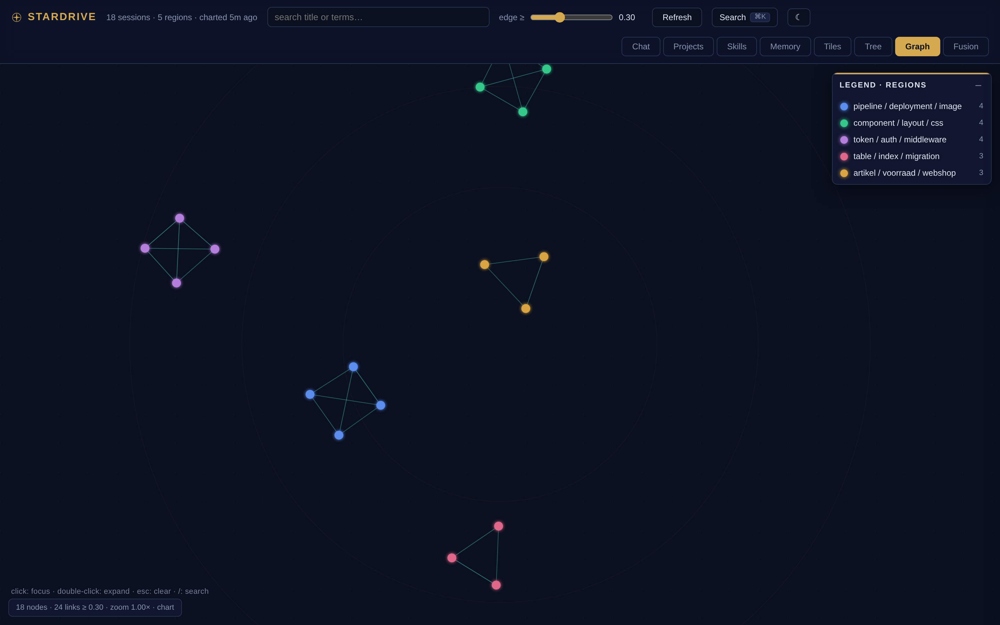
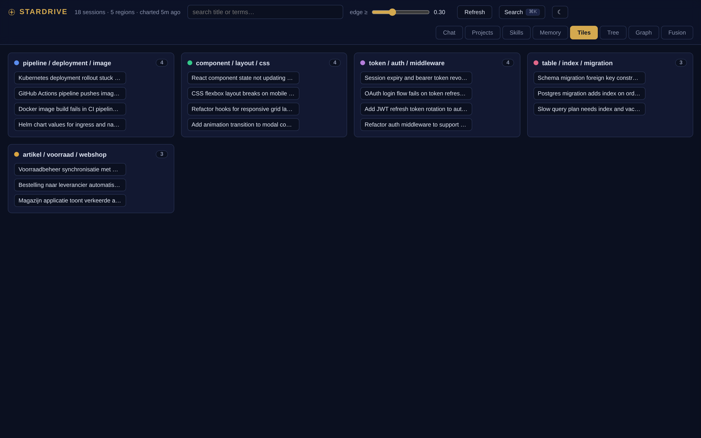
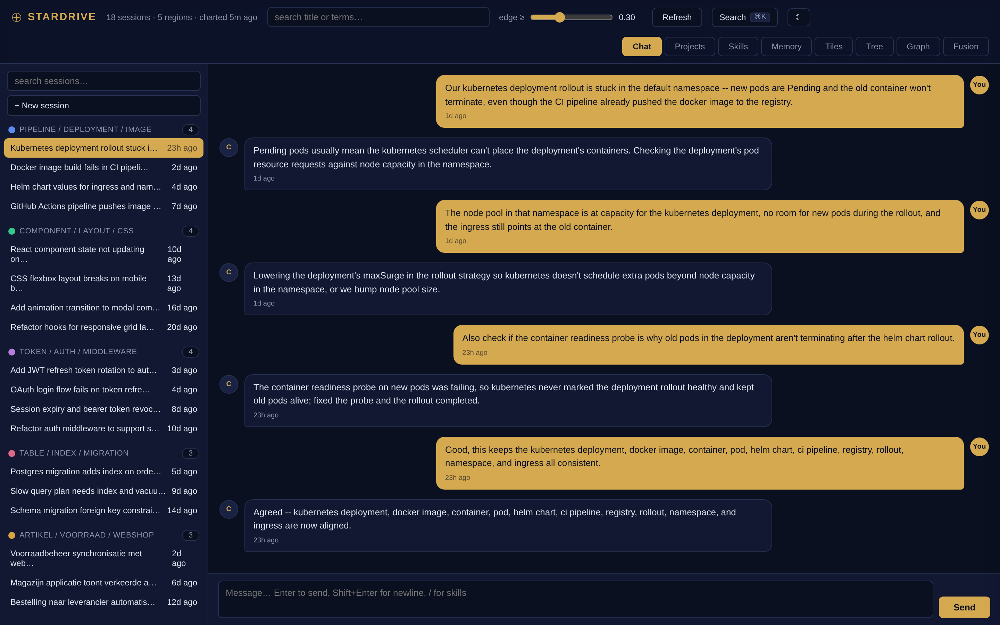
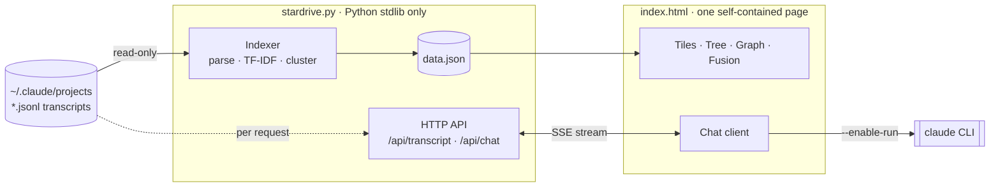

# Stardrive

**Cross your session galaxy.** The local workspace Claude Code should have shipped with.

Claude Code stores every conversation as a `.jsonl` transcript — but the built‑in UI only ever shows you a flat, chronological list. Stardrive reads that store (read‑only) and turns it into a workspace you can actually *navigate*: read any session as a real chat thread, prompt straight from it, and see the **shape** of everything you've ever worked on — auto‑clustered, graphed, and explained.

Two files. Python standard library + one self‑contained HTML page. No build step, no cloud, no telemetry, no dependencies.



## Why it's different

There are plenty of Claude Code session viewers. Every one of them renders your history as a **list**. Stardrive renders it as a **map** — and nothing else does:

- **Topic clustering** — sessions auto‑group by what they're *about* (local TF‑IDF, zero API calls).
- **A graph that teaches** — click any node and Stardrive explains it in plain language: what it's about, which cluster it belongs to, and *why* it links to each neighbour ("linked by: oauth, jwt, refresh‑token"). Not a graph that impresses you with complexity — one that quietly shows you how your work fits together.
- **Fusion candidates** — surfaces clusters of sessions that are probably the *same* thread of work, ready to merge or compact by hand.

Add to that a genuine client and a trust story the alternatives don't have: **two auditable files** you can read end‑to‑end before pointing them at transcripts that may contain your secrets — versus the ecosystem's Node/Electron/Tauri stacks pulling hundreds of dependencies.

## What's inside

**The client**
- 💬 **Chat** — read any session as a threaded conversation with tool calls, thinking, and per‑turn cost/token stats; then **prompt right there** — new session or resume — streamed live through the Claude Code CLI, with a **Stop** button and `/` skill autocomplete.
- ⌘ **Command palette** (`Ctrl`/`Cmd`+`K`) — fuzzy‑jump to any session, project, skill, or action.
- 📁 **Projects · 🧩 Skills · 🧠 Memory** — browse everything Claude Code knows, one click from using it.

**The intelligence layer**
- 🕸️ **Graph** — a force‑directed star‑chart of your sessions; edges are topic similarity, nodes glow by cluster. Focus a neighbourhood, expand it ring by ring, and read the story panel.
- 🗂️ **Tiles · 🌳 Tree** — the same clusters as cards, or as a project → topic → session hierarchy.
- 🔀 **Fusion** — same‑topic session groups above a similarity threshold you control.

**Everywhere**
- 🌗 Light + dark themes · ♿ keyboard‑operable with screen‑reader support and reduced‑motion — the only accessibility‑audited tool in its category · 📱 responsive down to phone width.

| | |
|---|---|
|  |  |

## Quickstart

```bash
python3 stardrive.py            # index your store, then serve
# open http://127.0.0.1:8877
```

That's it — no `pip install`. Python 3.8+ is the only requirement (plus the `claude` CLI if you want the Chat tab to actually run agents).

| Option | Default | What |
|---|---|---|
| `--root PATH` | `~/.claude/projects` | Claude Code session store location |
| `--bind IP` | `127.0.0.1` | interface to serve on (loopback by default) |
| `--port N` | `8877` | port |
| `--index-only` | | rebuild `data.json` and exit |
| `--serve` | | serve without re‑indexing |
| `--enable-run` | off | allow the Chat tab to actually run the `claude` CLI |
| `--run-timeout N` | `900` | seconds before a chat process is killed |

The **Refresh** button re‑indexes on demand. `data.json` (your indexed metadata) stays on your machine and is gitignored — never commit it.

Running it on a **remote desktop**? See **[DEPLOY.md](DEPLOY.md)** — the recommended pattern keeps Stardrive loopback‑only and reaches it over an SSH tunnel, so the server and your transcripts never leave that machine.

## Security & privacy

Your transcripts contain your prompts, code, and possibly secrets. Stardrive treats that seriously:

- **Read‑only** over `~/.claude` — the server never writes into your store (only the `claude` CLI does, when *you* prompt).
- **Loopback by default** — it binds `127.0.0.1` and validates the `Host` header; a Host allowlist plus cross‑origin POST rejection defend against DNS‑rebinding and CSRF from any website you happen to have open.
- **Zero external requests** — no CDN, no fonts, no analytics, from either the server or the page. Everything is inline.
- **`--enable-run` is opt‑in.** Without it the Chat tab is read‑only (browse threads, no prompting). The spawn path uses direct exec — no shell — so a prompt can't inject commands. Never combine `--enable-run` with a non‑loopback `--bind` on an untrusted network.

## Architecture



## How it works

1. Streams the top‑level `*.jsonl` transcripts (capped, malformed‑line tolerant), extracting each session's title, messages, tool calls, and thinking.
2. Builds TF‑IDF vectors (English + Dutch stopwords) and computes pairwise cosine similarity.
3. Union‑find clustering over the similarity graph; top terms label each cluster; the top‑25 weighted terms per session power the graph's plain‑language connection explanations.
4. One self‑contained `index.html` renders every view from `data.json` — the graph physics is ~150 lines of hand‑rolled velocity Verlet, no libraries.

## Contributing

A community project of [AI HUB Tilburg](https://github.com/atlasshb). Issues and PRs welcome — see [CONTRIBUTING.md](CONTRIBUTING.md). Good first targets: embedding‑based similarity as an optional backend, a usage/cost analytics view, continuation‑chain detection to strengthen fusion, and multi‑store support.

## License

[MIT](LICENSE)
